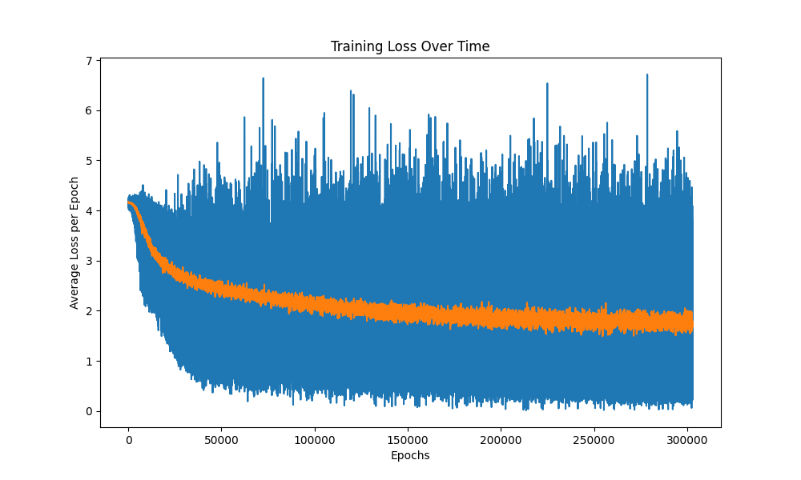

# How to Build Word2vec From Scratch 
## (Skip-gram with negative sampling)
This project implements [Word2Vec](https://arxiv.org/pdf/1301.3781) from scratch using only NumPy. Here I will try to explain as simply as possible how Word2Vec works.

For a long time, NLP researchers were trying to find ways to represent words as numbers. A simple approach was creating one-hot encodings of words in the dictionary, but the issue with that was the one-hot encodings did not capture the relationship between words. By relationship, I mean words that appear in the same context. For example, "king" and "queen" often appear in similar contexts, but "banana" and "pencil" do not.

Word2Vec solves this by creating embeddings of words where the embedding is meaningful and captures the semantic relationship between them. Imagine a 2D space where the words "school", "class", and "teacher" appear close together, but far away from words like "engine", "transmission", and "brakes", which refer to car parts. These groupings are what make the embeddings useful.

In this specific implementation, we let the model read the entire corpus and create pairs of words that appear close to each other in the corpus, given a window. So pairs are formed from a center word and all the surrounding words, either before or after the center word. This allows the model to guess the context words given a center word, and the fancy way of saying this is Skip-Gram.

We also utilize a concept called negative sampling, which means that every time we see a real (center, context) pair, we also sample k words that did not appear near the center word, and we try to push those further away in the embedding space. This discourages the model from placing unrelated words close together. However, we can’t just pick these negative words randomly from a uniform distribution. That’s because very frequent words like "the" or "is" would show up as negatives too often, which doesn't make sense. These words already appear everywhere, so they shouldn’t be treated like rare or niche words.

To fix that, we create what's called a unigram distribution. We count how many times each word appears in the corpus and then raise each count to the power of 0.75 to make the distribution smoother. Why 0.75? Because if the word "the" appears 100 times and "cpu" appears 35 times, their difference is 65. But if we raise both to the power of 0.75, their difference shrinks to about 17.2. This makes the frequent words a little less dominant and gives rare words more of a chance to be chosen as negatives.

When we train the model, we use a loss function, often called J, which tells us how badly the model is doing. For each (center, context) pair, we calculate the dot product between the center word vector and the context word vector. We pass that through a sigmoid to get a probability that these two words belong together. We do the same for each of the k negative samples. For those, we want the model to say that they do not belong together, so we take the negative of the dot product before applying sigmoid.

The total loss is the negative log of the probability that the true pair is correct, plus the log of the probability that all the negative samples are incorrect. The model then updates the embeddings using stochastic gradient descent to make the real pairs more likely and the negative pairs less likely. Over time, this pulls similar words closer together in the embedding space and pushes unrelated words apart.

By the end of training, you can do cool things like word analogies. For example:

`"king" is to "man" as "woman" is to "queen"`

This works because the model has learned consistent vector offsets that represent relationships like gender or royalty.

This whole project was implemented without any machine learning libraries or frameworks. It’s just raw NumPy and math, and it was a lot of fun to build.

## **Step 1:** Tokenize the Corpus
By **tokenize**, we mean cleaning the corpus by removing punctuation, special symbols like parentheses, and numbers, then splitting it into sentences where each sentence becomes a separate array of words. The reason we don’t just create one long list of tokens is because the model wouldn’t know when one sentence ends and the next one begins. This would result in words from different sentences being grouped together into skip-gram pairs, which would introduce noise. By keeping sentences separate, we ensure that word pairs are only formed from words that actually appear in the same context. In addition, to keep things consistent and avoid having two different tokens for the same word just because of capitalization, we lowercase all the words in the corpus. This ensures that "The", "the", and "THE" are all treated as the same token.

```python
import re
def tokenize(corpus):
  sentences = re.split(r'[.!?]', corpus) # seperate into sentences
  sentences = [s.strip() for s in sentences if s.strip() != ""] #removes white space
  sentences = [re.sub(r'[^a-zA-Z\s\']', "", s ) for s in sentences] #remove the puncations
  tokens = [s.lower().split() for s in sentences] # tokenize
  return tokens
```
## **Step 2:** Build a Vocabulary
Later on, we need a way to reference all the unique tokens in the corpus by an index, so it's a good idea to build a function that creates both a `word2idx` dictionary (mapping words to indices) and an `idx2word` dictionary (mapping indices back to words). It’s also useful to keep a list of the unique words themselves for later. 

The way we do this is simple:
  * First, we flatten the list of tokenized sentences into a single list of words.
  * Then we take the set of that list to get the unique words.
  * Finally, we use enumerate() to assign each word a unique index and build our dictionaries.

```python
def unique_vocab(tokens):
  return list(set([word for token in tokens for word in token])) #flatten and create set to get unique words

def vocabulary_builder(tokens):
  unique = unique_vocab(tokens)
  word2idx = {word:i for i,word in enumerate(unique)} # word to index dictionary
  idx2word = {i:word for i,word in enumerate(unique)} # index to word dictionary
  return word2idx, idx2word
```
## **Step 3:** Get Word Frequencies & Build Unigram Distribution 
We need the frequency of each unique word in our corpus, so it's best to write a function that counts them for us. We go through each sentence and then each word in the sentence, and we count how many times each word appears.
The output of this function is later used to build the unigram distribution for negative sampling. To create the unigram distribution, we raise each word's count to the power of 0.75. This smoothing step helps reduce the impact of extremely frequent words. After that, we sum all the adjusted counts and divide each one by the total to get a proper probability distribution.
This distribution allows us to sample negative words more intelligently, frequent words still show up more often, but not overwhelmingly so.
```python
def get_word_counts(tokens): 
  frequency = {}
  for sentences in tokens:
    for word in sentences:
      frequency[word] = frequency.get(word, 0) + 1
  return frequency
```
```python
def build_unigram_distribution(word2idx, word_counts):
  idx2prob = {}
  word_counts = {key: value**0.75 for key, value in word_counts.items()}
  total = sum(word_counts.values())
  unigram = {word2idx[key]: value / total for key, value in word_counts.items()}

  return unigram
```

## **Step 4:** Create Skip Gram Pairs & Sample Negatives 
We need to create center and context pairs for a given window size, which means generating word pairs that appear in similar contexts. This is the core of the Skip-Gram model. For example, if the window size is 2, the center word will be paired with the two words before and the two words after it (if they exist).
To generate these pairs, we can use the sliding window technique, similar to what’s commonly used in LeetCode problems. Conceptually, we slide a window over each sentence, treating the middle word as the center and the surrounding words as context. Each valid (center, context) pair is added to a list, which becomes the output of this function.
Once we have the positive pairs, we can define a negative sampling function. This function takes a real pair as input and returns k random words that should be pushed away from the center word in the embedding space. To do this properly, we exclude the indices of the center and context words from the unigram distribution. Then we re-normalize the remaining probabilities (by summing the leftover values and dividing each by the total), and finally sample k word indices from this adjusted distribution. These indices represent our negative samples.

```python
def create_skip_gram_pairs(tokens, window_size = 8): # create the training pairs with a default window size of 8
  pairs = []
  for sentence in tokens:
    sentence_len = len(sentence)
    for i, center_word in enumerate(sentence):
      for j in range(max(0, i - window_size), min(i + window_size + 1, sentence_len)):
        if i != j:
          pairs.append((center_word, sentence[j]))
  return pairs
```
```python
def sample_negatives(word2idx,unigram_dic,pair, k=15):
  # since pair is a pair of words we have to turn them into the indicies 
  exclude_idx = [word2idx[word] for word in pair]
  keys = []
  probs = []
  for key,value in unigram_dic.items():
    if key not in exclude_idx:
      keys.append(key)
      probs.append(value)

  # now we have to normalize again because now it doesn't add up to zero 
  total = np.sum(probs)
  probs = [prob / total for prob in probs]

  negative_samples = []

  for i in range(k):
    rand = np.random.choice(np.arange(0, len(keys)), p=probs) #this is how we can get random numbers using a custom distribution 
    negative_samples.append(keys[rand])

  return negative_samples
```

## **Step 5:** Initialize Embeddings & Calculate Loss & Sigmoid Function

Before training, we initialize the embeddings with small random values. A common practice is to sample uniformly from the range:

$$
\left[ -\frac{1}{\sqrt{d}}, \frac{1}{\sqrt{d}} \right]
$$

where \( d \) is the embedding dimension.

We create two embedding matrices:
- \( V \): for center words (input vectors)
- \( U \): for context words (output vectors)

```python
def initialize_embeddings(vocab_size, embedding_dim):
  low = (-1) / np.sqrt(embedding_dim)
  high = 1 / np.sqrt(embedding_dim)
  
  U = np.random.uniform(low, high, size = (vocab_size, embedding_dim)) #context
  V = np.random.uniform(low, high, size = (vocab_size, embedding_dim)) #center

  return V, U 
```

**Loss Function**

The objective function we minimize is based on **Skip-Gram with Negative Sampling (SGNS)**. For a given positive pair \( (w_c, w_o) \), and \( k \) negative samples \( w_1, \dots, w_k \), the loss function is:

$$
J = -\log\left(\sigma(u_o^\top v_c)\right) - \sum_{i=1}^{k} \log\left(\sigma(-u_i^\top v_c)\right)
$$

Where:
- \( v_c \) is the embedding of the **center word** from \( V \)
- \( u_o \) is the embedding of the **true context word** from \( U \)
- \( u_i \) are the embeddings of the **negative samples** from \( U \)
- \( \sigma(x) \) is the sigmoid function

```python
def compute_loss(v_c, u_o, u_k):
  sum = 0
  for u_neg in u_k:
    product = np.dot(v_c, u_neg)
    sig = sigmoid(-product)
    sum +=  np.log(sig)
  
  dot_prod = np.dot(u_o, v_c)
  sigmoid_of_prod = sigmoid(dot_prod)
  log_of_sig = np.log(sigmoid_of_prod) 
  return (-log_of_sig - sum)
```
  
**Sigmoid Function**

The sigmoid function is used to convert the dot product into a probability-like score:

$$
\sigma(x) = \frac{1}{1 + e^{-x}}
$$

```python
def sigmoid(x): 
  return 1 / (1 + np.exp(-x))
```

## **Step 6:** Training Step & Compute Gradients

The `training_step` function is what we’ll use inside our training loop. For each call, we take as input a word pair from the skip-gram pairs, a learning rate, the embedding matrices `U` and `V`, and the `word2idx` dictionary.

We start by calling `sample_negatives()` to get `k` negative samples for the current pair. We then retrieve the embeddings for:
- the **center word** (`v_c`) from matrix `V`,
- the **true context word** (`u_o`) from matrix `U`, and
- the **negative sample words** (`u_k`) also from `U`.

We use these to compute the loss using our `compute_loss` function.

**Gradients**
We calculate the partial derivatives of the loss function with respect to:
- the center word embedding \( v_c \)
- the true context word embedding \( u_o \)
- the embeddings for each negative sample \( u_k \)

The gradients are as follows:


$$
\frac{\partial J}{\partial v_c} = (\sigma(u_o^\top v_c) - 1) \cdot u_o + \sum_{i=1}^{k} \sigma(u_i^\top v_c) \cdot u_i
$$

$$
\frac{\partial J}{\partial u_o} = (\sigma(u_o^\top v_c) - 1) \cdot v_c
$$

$$
\frac{\partial J}{\partial u_i} = \sigma(u_i^\top v_c) \cdot v_c \quad \text{for each negative sample } u_i
$$

We compute these using the `compute_gradients` function below:

```python
def compute_gradients(v_c, u_o, u_k):
    # Gradient w.r.t v_c
    sum_v_c = np.sum([sigmoid(np.dot(v_c, u_neg)) * u_neg for u_neg in u_k], axis=0)
    d_v_c = (sigmoid(np.dot(v_c, u_o)) - 1) * u_o + sum_v_c
    
    # Gradient w.r.t u_o  
    d_u_o = (sigmoid(np.dot(u_o, v_c)) - 1) * v_c
    
    # Gradient w.r.t each u_k
    d_u_k = [sigmoid(np.dot(u_neg, v_c)) * v_c for u_neg in u_k]
    
    return d_v_c, d_u_o, d_u_k
```
These gradients tell us the direction in which we should move to reduce the loss. The learning rate controls how far we move in that direction. We update the vectors by subtracting the gradient multiplied by the learning rate. This is the essence of Stochastic Gradient Descent (SGD).
The updated vectors are placed back into matrices `U` and `V`. We return the loss so we can track it during training.
```python
def training_step(pair, learning_rate, V, U, word2idx, unigram_dic):
    negative_samples = sample_negatives(word2idx, unigram_dic, pair)
    center_idx = word2idx[pair[0]]
    outside_idx = word2idx[pair[1]]

    v_c = V[center_idx].copy()  # vector for the center word
    u_o = U[outside_idx].copy() # vector for the outside word
    u_k = [U[idx].copy() for idx in negative_samples]

    loss = compute_loss(v_c, u_o, u_k)

    d_v_c, d_u_o, d_u_k = compute_gradients(v_c, u_o, u_k)

    V[center_idx] -= learning_rate * d_v_c
    U[outside_idx] -= learning_rate * d_u_o

    for i, idx in enumerate(negative_samples):
        U[idx] -= learning_rate * d_u_k[i]

    return loss

```

## **Step 7:** Main Training Loop 
In the main training loop, we take the initial embedding matrices `U` and `V`, the number of epochs, all the skip-gram pairs, the learning rate, the `word2idx` dictionary, and the `unigram_dic` for negative sampling.
We train the model over the number of epochs specified. For each epoch, we **shuffle the training pairs** to prevent the model from memorizing the order and overfitting to specific sequences.
During each iteration, we loop through every training pair and pass it into the `training_step` function. This function computes the loss, updates `U` and `V` using stochastic gradient descent, and returns the loss so we can track training progress.
Shuffling the pairs after every epoch is important because it ensures the model generalizes better rather than learning patterns from the fixed order of word pairs.

```python
def main_training_loop(V,U, epochs, pairs, learning_rate, word2idx, unigram_dic):
  #shuffle the pairs 
  #loop over the epochs
  #update V and U 
  losses = []

  for _ in range(epochs):
    random.shuffle(pairs)
    for pair in pairs:
      loss = training_step(pair, learning_rate, V, U, word2idx, unigram_dic)
      losses.append(loss)
    
  return losses

```

```python
def word2vec(corpus, embedding_dim=100, epochs=100, learning_rate=0.01):
    tokens = tokenize(corpus)
    unique_words = unique_vocab(tokens)
    word2idx, _ = vocabulary_builder(tokens)
    word_freq = get_word_counts(tokens)
    word_pairs = create_skip_gram_pairs(tokens)
    unigram = build_unigram_distribution(word2idx, word_freq)
    V, U = initialize_embeddings(len(unique_words), embedding_dim)
    losses = main_training_loop(V, U, epochs, word_pairs, learning_rate, word2idx, unigram)
    return V, U, word2idx, losses
```

--- 

### Plotting The loss:
After getting the loss array from our function you can then plot the loss by using `matplotlib`:
```python
print(f"Final loss: {losses[-1]:.4f}")
print(f"Initial loss: {losses[0]:.4f}")

plt.figure(figsize=(10, 6))
plt.plot(losses)
plt.title("Training Loss Over Time")
plt.xlabel("Epochs")
plt.ylabel("Average Loss per Epoch")
window = 100
smoothed = np.convolve(losses, np.ones(window)/window, mode='valid')
plt.plot(smoothed)
plt.savefig("loss_plot")
```
*Example*

*Figure 1: Word2Vec training loss decreasing over epochs*
 
### Visualize Using PCA 
You can also visualize the learned word embeddings in **2D space** using **Principal Component Analysis (PCA)**. PCA is a technique for **dimensionality reduction** that projects high-dimensional data into a lower-dimensional space while preserving as much variance as possible.
Since our embeddings typically live in a space with 50 or 100 dimensions, PCA helps us plot them in 2D so we can get an intuitive sense of the structure.

```python
from sklearn.decomposition import PCA

U,V, word2idx, losses = word2vec(corpus)
words_to_plot = ["man", "king", "woman", "queen"]
indicies = [word2idx[word] for word in words_to_plot]
vectors_to_plot = np.array([final_embeddings[idx] for idx in indicies])
pca = PCA(n_components=2)
reduced = pca.fit_transform(vectors_to_plot)

plt.figure(figsize=(8,6))
for i,word in enumerate(words_to_plot):
  x, y = reduced[i]
  plt.scatter(x,y)
  plt.text(x + 0.02, y + 0.02, word, fontsize=12)

plt.title("Word Embeddings Visualized with PCA")
plt.grid(True)
plt.show()
plt.savefig("visualized")
```

*Figure 1: Example Plot for "King", "man" "queen" "woman"*


